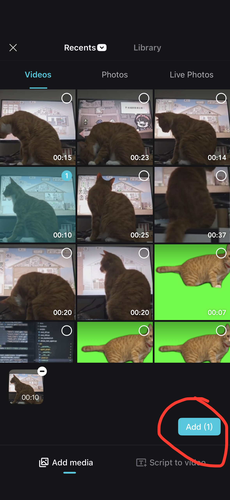
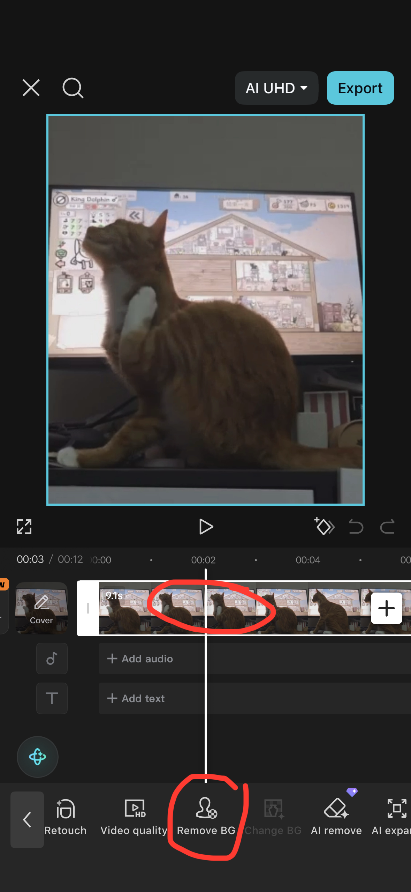
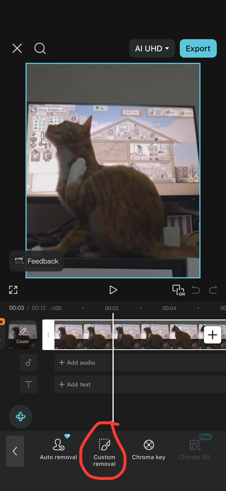
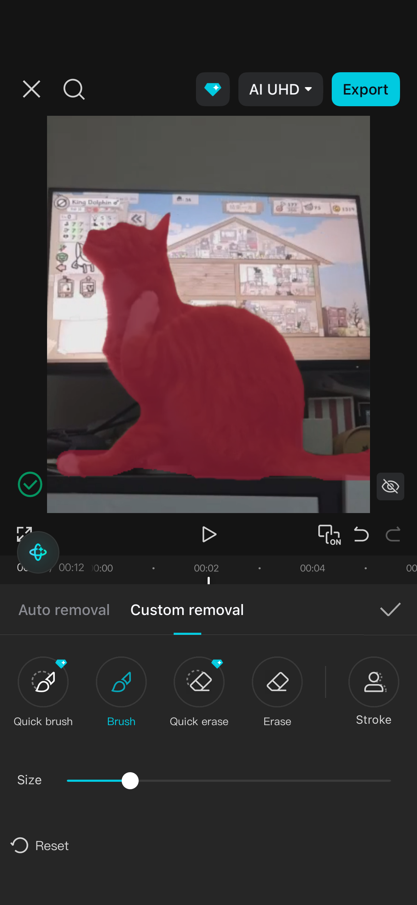
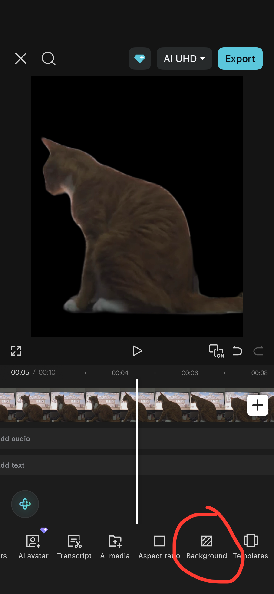
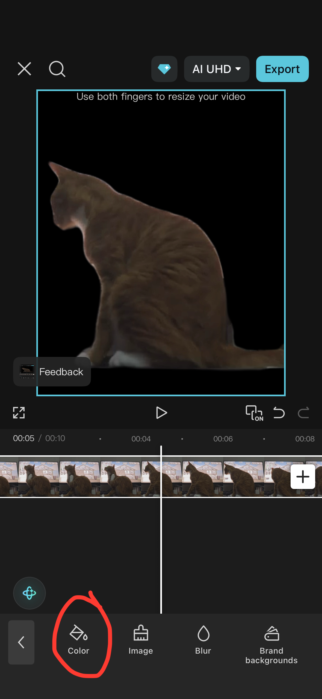
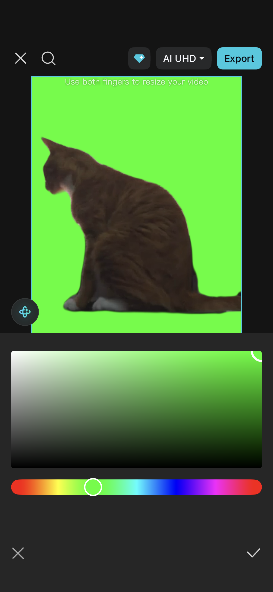
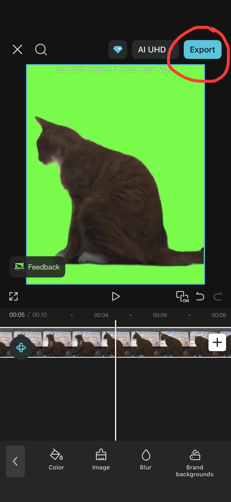

# DeskPet MVP

DeskPet MVP turns a real green-screen cat video into a transparent desktop pet. It is an Electron prototype for creating, saving, and launching animated cat companions on macOS and Windows.

## Features

- Upload a short green-screen cat video.
- Extract frames with ffmpeg to avoid HDR/browser canvas color shifts.
- Remove the green background and preview transparent frames.
- Adjust green tolerance, frame exposure, and shadow lift.
- Align frames manually with ground-line keyframes or track one body point with OpenCV.
- Save animations as `.deskpet.json` packages.
- Launch one or more transparent always-on-top desktop pet windows.
- Lock a pet so it does not block normal clicks, then unlock it from a small hover control.
- Access the app from the macOS menu bar.
- Build macOS `.dmg` and Windows `.exe` installers.

## Install and Run

There are two ways to use DeskPet.

### Option 1: Download an Installer

This is the recommended path for regular users.

1. Go to the GitHub Releases page for this project.
2. Download the installer for your platform:
   - macOS Apple Silicon: `DeskPet-0.1.0-arm64.dmg`
   - Windows: `DeskPet Setup 0.1.0.exe`
3. Install and open DeskPet.

On macOS, the app is currently unsigned. If macOS blocks the first launch, open **System Settings -> Privacy & Security** and allow DeskPet manually.

### Option 2: Run from Source

This is the recommended path for developers.

Requirements:

- macOS is the primary tested platform. Windows packaging is configured but needs testing on Windows.
- Node.js and npm.
- Electron.
- ffmpeg and ffprobe.
- Optional: Python + OpenCV for body-point tracking and alignment.

The app automatically looks for ffmpeg/ffprobe in environment variables, a bundled `bin/` folder, and common system locations.

Environment variables:

```bash
FFMPEG_PATH=/path/to/ffmpeg
FFPROBE_PATH=/path/to/ffprobe
PYTHON_PATH=/path/to/python
```

Common macOS paths:

```bash
/opt/homebrew/bin/ffmpeg
/opt/homebrew/bin/ffprobe
```

Common Windows paths:

```text
C:\ffmpeg\bin\ffmpeg.exe
C:\ffmpeg\bin\ffprobe.exe
C:\Program Files\ffmpeg\bin\ffmpeg.exe
C:\Program Files\ffmpeg\bin\ffprobe.exe
```

Install dependencies:

```bash
npm install
```

OpenCV is only used by the optional **Track Body Point** feature for stabilizing/alignment. It is not required for the desktop pet or mouse-follow effect.

If you want OpenCV tracking, install it in the Python environment used to run the app:

```bash
pip install opencv-python
```

From the project directory:

```bash
npm start
```

On macOS, you can also double-click:

```text
Launch DeskPet.command
```

The launcher uses the local Electron install when available. If Electron is not installed locally, it falls back to `npm install && npm run app`.

## Package Installers

Install dependencies first:

```bash
npm install
```

Create an unpacked `.app` for local testing:

```bash
npm run pack
```

Create a macOS `.dmg`:

```bash
npm run dist:mac
```

Create a Windows `.exe` installer on Windows:

```bash
npm run dist:win
```

The build output is written to `release/`.

The default `npm run dist` command uses the platform-specific targets in `package.json`.

For GitHub releases, use the included workflow:

```text
.github/workflows/build-installers.yml
```

It builds:

- macOS artifact: `release/*.dmg`
- Windows artifact: `release/*.exe`

The packaged app can run without ffmpeg, but frame extraction may fall back to browser canvas capture. For best color handling, install ffmpeg on the user's machine or bundle ffmpeg/ffprobe into a `bin/` folder before building.

## Usage

1. Upload a 3-8 second green-screen cat video.
2. Click **Process Video**.
3. Tune green tolerance and exposure settings if needed.
4. Optionally align the animation with ground-line keyframes or OpenCV body-point tracking.
5. Click **Save Package** or **Send to Desktop**.
6. In the desktop pet window, use **Look** for a lightweight full-body mouse-follow effect.
7. Use **Lock** to make the pet click-through. Hover the unlock control to reveal it.

Saved packages are written to `packages/` by default. This folder is ignored by Git because package files can become large.

## Example Green-Screen Videos

Example source videos are available in `samples/`:

- [`samples/cat_Ares.MOV`](samples/cat_Ares.MOV)
- [`samples/cat_Zobo.MOV`](samples/cat_Zobo.MOV)

For best results, record source clips with:

- a clean, uncluttered background before editing;
- a stable camera angle and minimal handheld shake;
- the full subject visible inside the frame for the whole clip;
- short loop-friendly motion, ideally around 3-8 seconds.

The example green-screen clips were prepared with CapCut before being imported into DeskPet.

## CapCut Green-Screen Preparation

The rough workflow is:

1. Import a short cat video into CapCut.
2. Cut out the subject with CapCut's background removal tools.
3. Place the cut-out subject over a pure green background.
4. Export a short green-screen video.
5. Import that green-screen video into DeskPet.

Step screenshots:

| 1 | 2 | 3 | 4 |
|---|---|---|---|
|  |  |  |  |
| 5 | 6 | 7 | 8 |
|  |  |  |  |

## Demo Assets

Use these folders for shareable media:

```text
assets/      README screenshots, GIFs, and demo recordings
samples/     Small green-screen source videos people can try
```

Recommended file names:

```text
assets/demo.gif
assets/screenshot-main.png
assets/screenshot-pet.png
samples/cat-sit-green-screen.mp4
samples/cat-look-green-screen.mp4
```

Keep sample videos short and reasonably compressed. If the videos are large, use Git LFS or attach them to a GitHub Release instead of committing them directly.

## Project Structure

```text
.
├── electron-main.js       Electron main process, windows, tray menu, ffmpeg, package IO
├── preload.js             Safe IPC bridge exposed to renderer windows
├── index.html             Main processing UI
├── script.js              Video processing, keying, preview, package creation
├── styles.css             Main UI styles
├── pet.html               Desktop pet window
├── pet.js                 Pet animation, locking, resizing, mouse-follow behavior
├── pet.css                Desktop pet styles
├── assets/                Optional screenshots, GIFs, and demo recordings
├── samples/               Optional green-screen sample videos
├── unlock.html            Click-through unlock control window
├── unlock.js              Unlock control behavior
├── unlock.css             Unlock control styles
├── scripts/
│   └── track_point.py     OpenCV point tracker
└── matting-api.md         Notes for future matting API integration
```

## Development Checks

```bash
npm run check
```

This runs JavaScript syntax checks for the Electron main process and renderer scripts.

## Notes

- The MVP is optimized for green-screen source videos, not arbitrary real backgrounds.
- Always-on-top behavior can vary across macOS versions and desktop settings.
- macOS installers are unsigned unless you add an Apple Developer ID certificate.
- Windows installers are unsigned unless you add a code-signing certificate.
